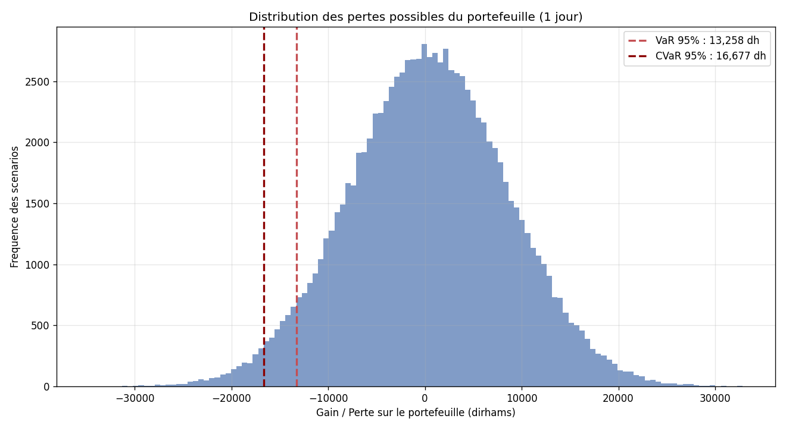

# Value at Risk et CVaR : portefeuille Bourse de Casablanca

Un modèle Python qui calcule la Value at Risk d'un portefeuille d'actions de la Bourse de Casablanca, par trois méthodes complémentaires. La VaR est la mesure de risque de référence des salles de marchés, imposée quotidiennement aux banques par la réglementation de Bâle.

## Objectif

La Value at Risk répond à une question centrale du risk management : dans le pire des cas, combien peut-on perdre sur un portefeuille sur un horizon donné ? Une VaR à 95% de 13 000 dirhams signifie qu'il y a 95% de chances de ne pas perdre plus de 13 000 dirhams sur la journée. Ce projet calcule cette mesure de trois façons différentes et la complète par la CVaR, plus prudente.

## Les trois méthodes

La méthode historique classe les rendements passés du pire au meilleur et prend le seuil correspondant au niveau de confiance, sans aucune hypothèse sur la forme de la distribution. La méthode paramétrique suppose que les rendements suivent une loi normale et déduit la VaR de ses paramètres, rapide mais moins fiable face aux événements extrêmes. La méthode Monte Carlo simule un grand nombre de scénarios de rendements et en déduit le seuil de perte, approche flexible adaptée aux portefeuilles complexes.

## La CVaR

Au-delà de la VaR, le modèle calcule la CVaR, aussi appelée Expected Shortfall, qui mesure la perte moyenne dans les scénarios où la perte dépasse la VaR. C'est une mesure plus prudente du risque extrême, aujourd'hui privilégiée par la réglementation de Bâle car elle capture mieux la gravité des pertes exceptionnelles.

## Résultats

Sur un portefeuille d'un million de dirhams réparti entre cinq actions marocaines, les trois méthodes convergent vers une VaR journalière d'environ 13 250 dirhams à 95% de confiance, ce qui confirme la cohérence du modèle. La CVaR s'établit à environ 16 700 dirhams : c'est la perte moyenne attendue dans les 5% de journées les plus défavorables.



Le graphique montre la distribution des gains et pertes journaliers du portefeuille, avec le seuil de VaR marqué en rouge et la zone des pertes extrêmes mise en évidence.

## Le portefeuille

L'analyse porte sur cinq valeurs de la Bourse de Casablanca : Attijariwafa Bank, Maroc Telecom, BCP, Cosumar et Marsa Maroc, avec des pondérations définies. Les rendements sont générés de façon réaliste en tenant compte des corrélations entre actions, afin que le modèle soit reproductible sans données de marché confidentielles.

## Concepts appliqués

Value at Risk, CVaR (Expected Shortfall), niveau de confiance, méthodes historique, paramétrique et Monte Carlo, corrélation entre actifs, distribution des rendements et réglementation de Bâle.

## Technologies

Python 3, avec NumPy pour les calculs, SciPy pour la loi normale et Matplotlib pour la visualisation.

## Comment lancer

```
pip install numpy scipy matplotlib
python value_at_risk.py
```

Le programme affiche les résultats en console et génère l'image var_resultats.png.

Projet réalisé dans le cadre de mon parcours en Finance (M2, ENCG Fès).
